# 🌟 Inventory & POS Management System

A lightweight, modern, and secure web-based Inventory and Point of Sale (POS) Management System built using native **PHP 8+**, **MySQL**, **Bootstrap 5**, **Chart.js**, and **jQuery**.

This repository showcases a complete backoffice administration suite integrated with a responsive cashier POS terminal, custom pricelist engines, and stock ledgers.

---

## 📸 Complete System Showcase

### 1. Secure Authentication Login
- **File**: `image/01_login_screen.png`
- **Description**: Secure credential entry page supporting bcrypt password hashing, CSRF verification, and secure cookie sessions.
- 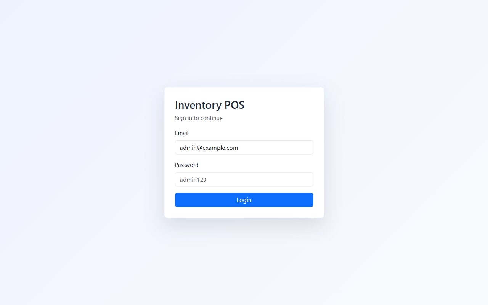

---

### 2. Analytical Backoffice Dashboard
- **File**: `image/02_dashboard.png`
- **Description**: Live dashboard reflecting critical system metrics (Total Products, Active Categories, Current Stock, Today's Sales, Open Sessions) alongside dynamic Chart.js daily sales tracking.
- 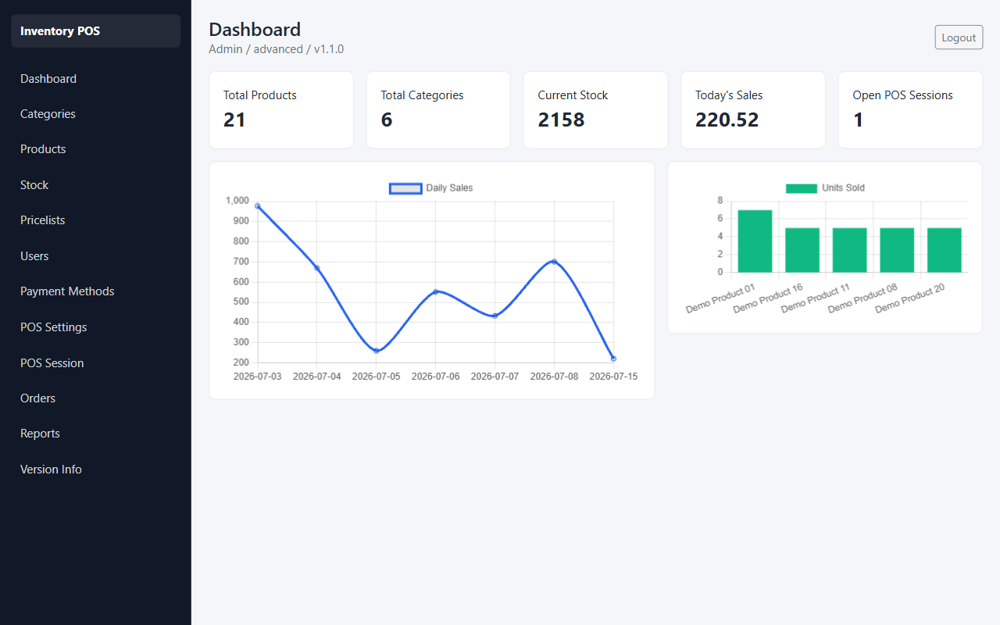

---

### 3. Categories Management
- **File**: `image/03_categories_list.png`
- **Description**: Interactive category grouping index enabling standard CREATE, READ, UPDATE, and DELETE operations.
- 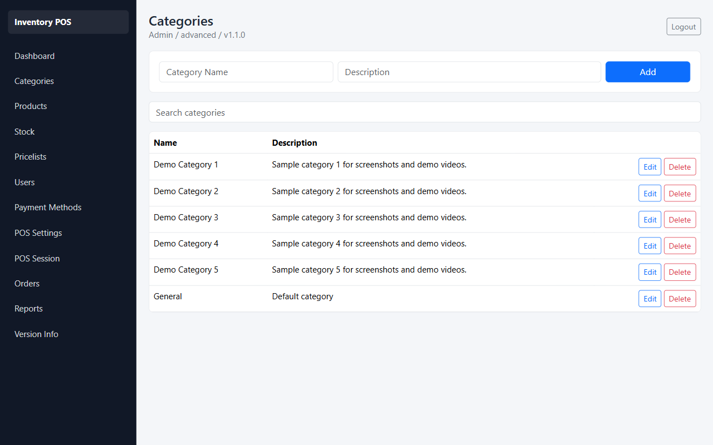

---

### 4. Inventory Products Catalog
- **File**: `image/04_products_list.png`
- **Description**: Central inventory registry showcasing item prices, stock level alerts, custom barcodes, and expiration tracking dates.
- 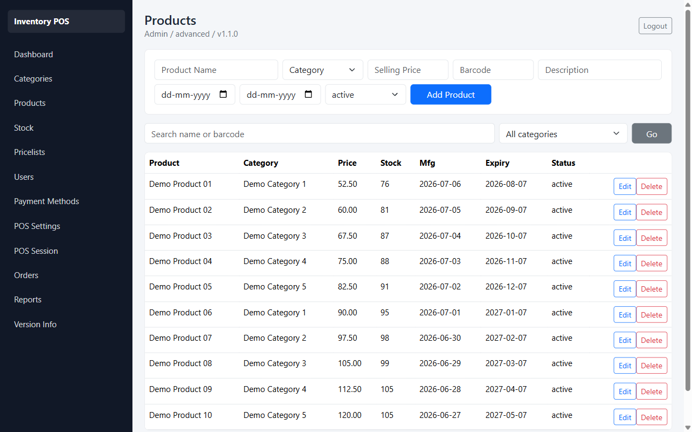

---

### 5. Stock Level Tracking & Ledger
- **File**: `image/05_stock_list.png`
- **Description**: Dynamic ledger tracking incoming and outgoing stock entries, showing logs of individual transaction quantities, cost prices, dates, and remarks.
- 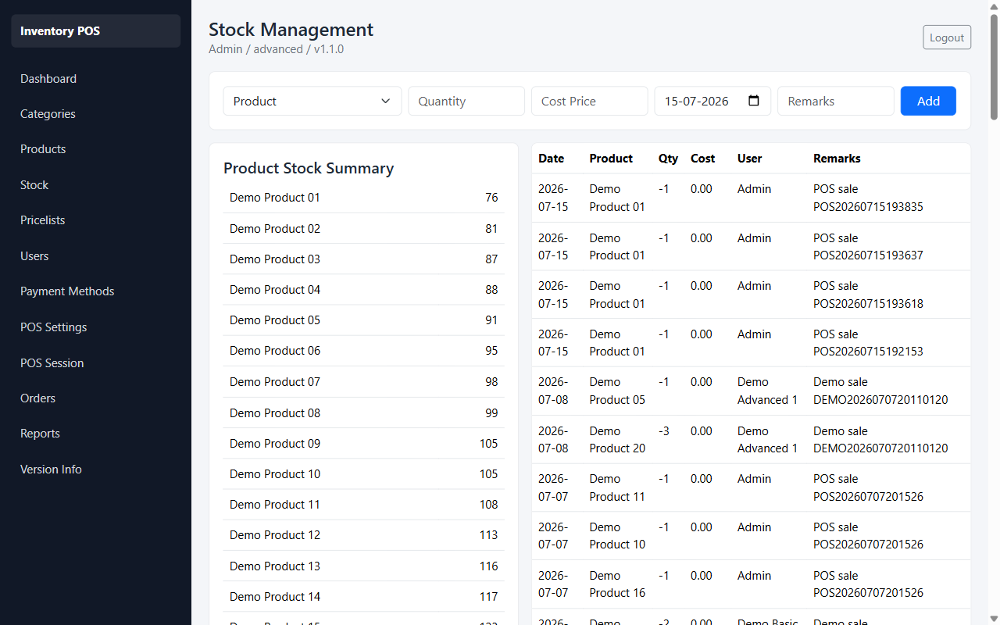

---

### 6. Pricelists & Price Rules
- **File**: `image/06_pricelists_list.png`
- **Description**: Advanced rules engine mapping custom retail, wholesale, and distributor prices using category or product percentage/fixed value modifiers.
- 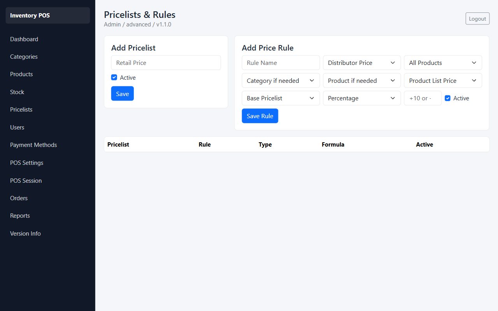

---

### 7. Users Roles Control
- **File**: `image/07_users_list.png`
- **Description**: Accounts database letting administrators configure credentials and assign access clearances (`minimal`, `basic`, or `advanced`).
- 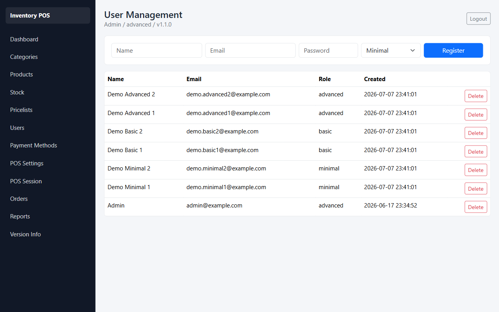

---

### 8. Payment Methods Configurator
- **File**: `image/08_payment_methods.png`
- **Description**: System settings to activate, suspend, or create accepted payment types (Cash, UPI, Credit/Debit cards, etc.).
- 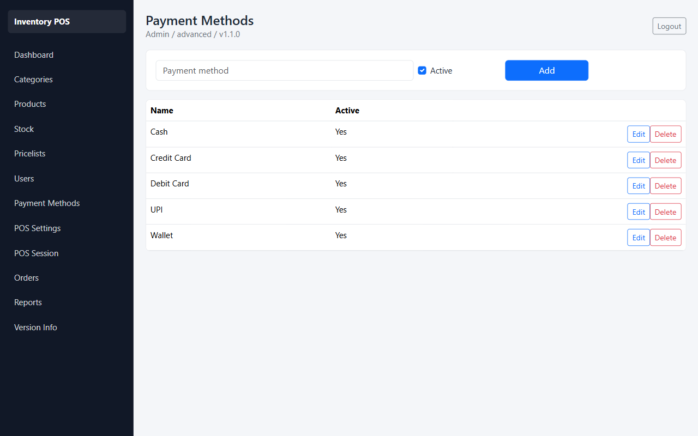

---

### 9. POS Terminal Configuration
- **File**: `image/09_pos_settings.png`
- **Description**: Configuration manager controlling active terminal parameters, linked warehouses, defaults, and cashier receipt headers.
- 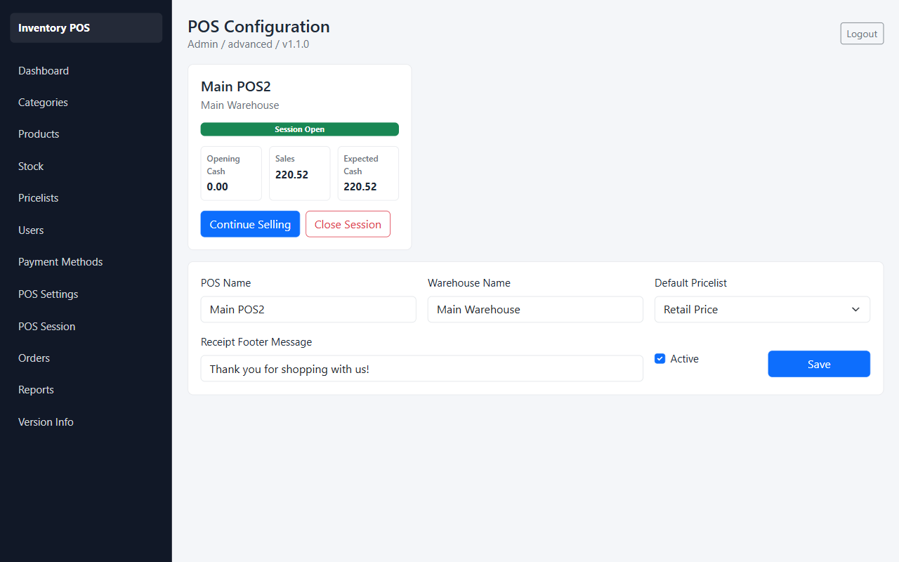

---

### 10. Cash Session Ledger
- **File**: `image/10_pos_session.png`
- **Description**: Security controls enabling cash drawer oversight where operators declare opening balances and reconcile expected sales prior to terminal closing.
- 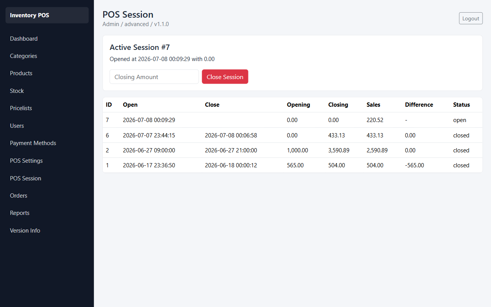

---

### 11. Point of Sale Cashier Terminal
- **File**: `image/11_pos_terminal.png`
- **Description**: Highly optimized, fullscreen terminal for cashiers. Features a quick-add search grid, custom customer tag inputs, item quantity counters, and multi-layered payment lines.
- 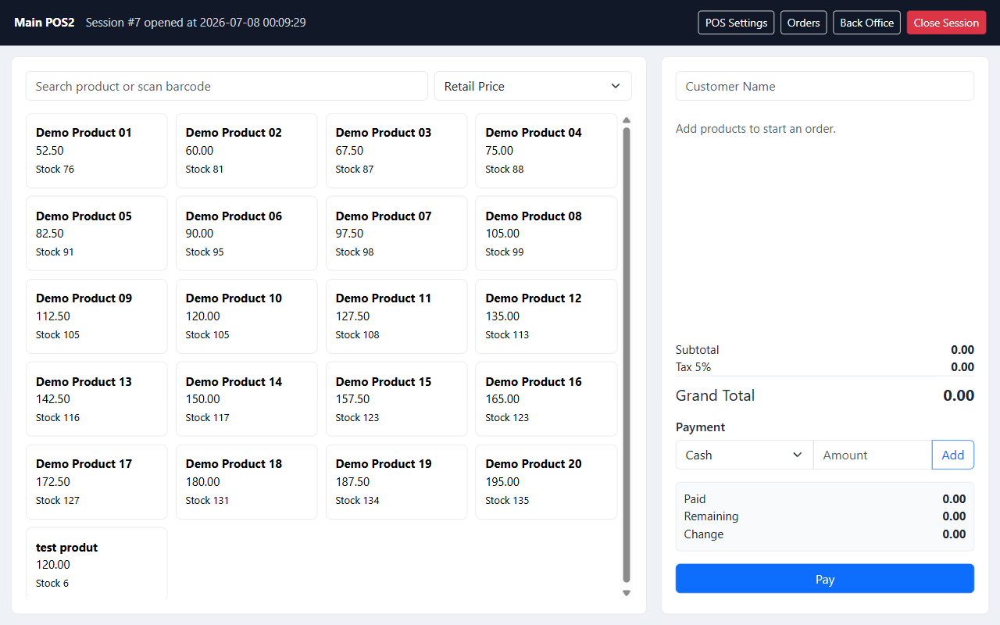

---

### 12. Checkout Invoice Receipt
- **File**: `image/12_pos_receipt.png`
- **Description**: Automatically formatted cashier invoice print preview mapping sold items, quantity subtotals, tax fractions, and receipt footer text.
- 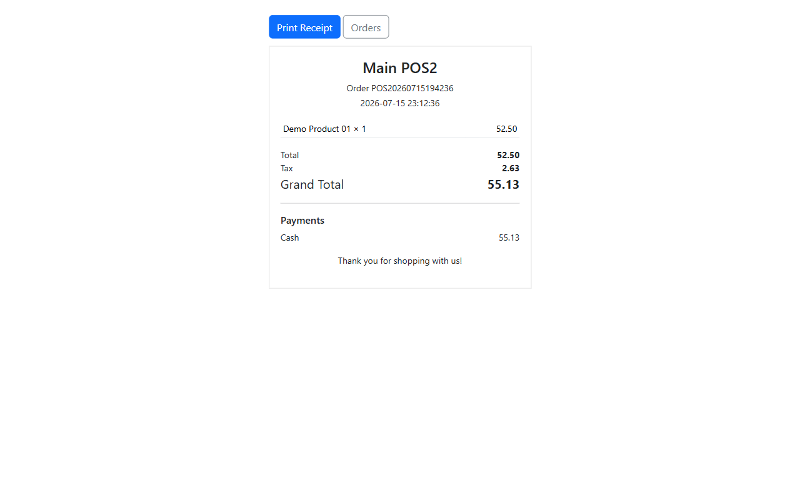

---

### 13. POS Orders Log
- **File**: `image/13_orders_list.png`
- **Description**: Historical order lookup showing time, buyer references, checkout amounts, and corresponding session details.
- 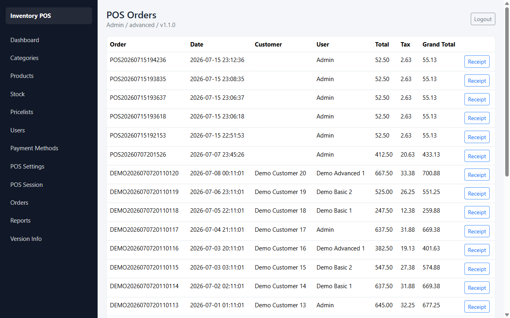

---

### 14. Sales Summary Reports
- **File**: [image/14_reports.png](./image/14_reports.png)
- **Description**: Dynamic business analyzer grouping total inventory volume and revenue figures filtered by specific date ranges.
- 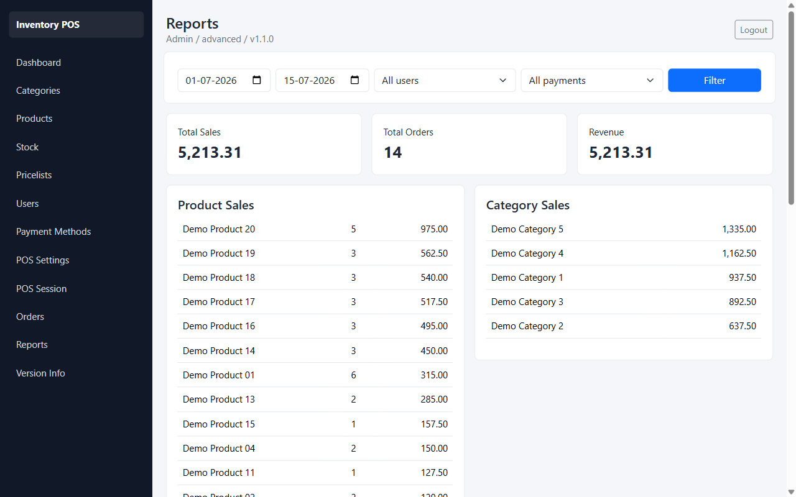

---

### 15. System Build & Version Info
- **File**: `image/15_version_info.png`
- **Description**: Application release version logger mapping active framework layers and code build timestamps.
- 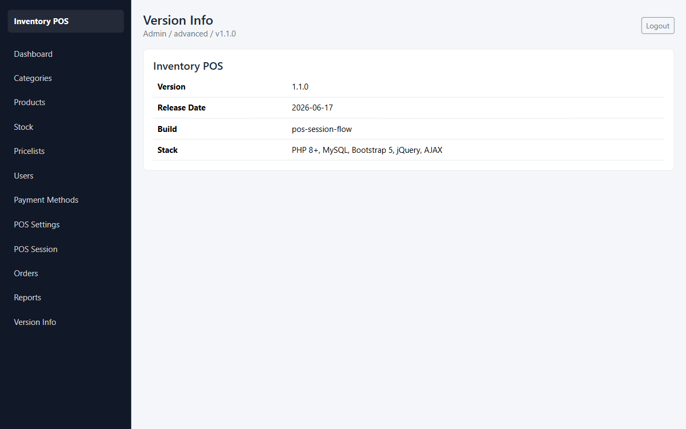

---

## 🛠️ Technology Stack

- **Backend:** PHP 8+ (Structured native PHP using PDO for database operations)
- **Database:** MySQL / MariaDB (Prepared statements, relational integrity with foreign keys)
- **Frontend:** Bootstrap 5, Chart.js (Interactive dashboards), jQuery, and CSS custom variables
- **Security:** CSRF Protection, HTTPOnly/SameSite Session Cookies, Escaped HTML Output (`htmlspecialchars`), Password Hashing (`bcrypt`)

---

## 📁 Directory Structure

```text
inventory_pos/
├── assets/                  # Public assets
│   ├── css/
│   │   └── style.css        # Main stylesheet (custom variable styling, responsive layout)
│   ├── images/              # Image placeholders and assets
│   └── js/
│       └── app.js           # Shared JS helper functions (e.g. deletion confirmation dialogs)
├── config/                  # Configuration scripts
│   ├── auth.php             # Session management, authorization helpers, CSRF protection
│   ├── database.php         # PDO database connection pool
│   └── version.php          # Application version details
├── database/                # Database schemas
│   └── schema.sql           # Complete SQL script for database setup and tables
├── image/                   # Local folder containing all system screenshot images
├── modules/                 # Application feature modules
│   ├── categories/          # Product category CRUD management
│   ├── pos/                 # POS frontend terminal, APIs, session control, and settings
│   ├── pricelist/           # Pricing engine, dynamic rule creation
│   ├── products/            # Inventory products management (barcodes, pricing, tracking)
│   ├── reports/             # Sales summary reports and logs
│   ├── stock/               # Stock levels & incoming/outgoing transaction log entries
│   └── users/               # Multi-level user role management
├── templates/               # Reusable UI layout elements
│   ├── footer.php           # Common footer layout
│   ├── header.php           # Common header layout (navigation, metadata, shell initialization)
│   └── sidebar.php          # Dynamic sidebar menu loaded based on current user roles
├── dashboard.php            # Analytics dashboard containing sales charts and KPIs
├── index.php                # Gateway controller directing users to dashboard/login
├── login.php                # Authentication login screen
├── logout.php               # Destroys current session and redirects
└── version.php              # Displays detailed system build version status
```

---

## 🔑 Key Features

### 1. Robust Authentication & Roles
Provides granular access control for three levels of user roles:
- **`minimal`**: Access to view basic dashboards and reports.
- **`basic`**: Access to general dashboard, stock management, and POS terminal operations.
- **`advanced`**: Full admin access, including user accounts control, payment method setup, and pricelist rule overrides.

### 2. Point of Sale (POS) Terminal
- **Sessions**: Secure cash control with session tracking. Operators must declare an opening amount when initiating a terminal session and verify closing balances when closing.
- **Cashier UI**: Fully responsive fullscreen screen layout with a searchable product catalog, interactive order cart, and multi-mode payment line items.
- **Receipts**: Automated receipt generation showing quantities, sub-totals, pricelist discounts, and customized footer messages.

### 3. Smart Pricelists and Rules
Supports dynamic pricing structures (Retail, Wholesale, Distributor) using rules that calculate pricing based on:
- Global scope, category scope, or product-specific scope.
- Pricing adjustments (Percentage increase/decrease, or Fixed amount adjusters).

### 4. Stock Tracking & Product Control
- Track barcode, selling price, manufacturing date, and expiry date.
- Real-time stock counts derived from incoming/outgoing stock transaction entries containing cost logs and operator remarks.

### 5. Interactive Dashboards & Reporting
- KPI Cards displaying: *Total Products*, *Total Categories*, *Current Stock*, *Today's Sales*, and *Open POS Sessions*.
- Chart.js dashboards showing weekly daily sales trends and top-performing products.
- Exportable sales records and product inventory lists.

---

## ⚡ Setup Instructions

### Prerequisites
- PHP 8.0 or higher
- MySQL / MariaDB database server
- A local server environment like XAMPP, WampServer, or Docker

### Installation Steps
1. **Clone or Copy** the repository folder into your web server's root directory (e.g. `C:\xampp\htdocs\inventory_pos`).
2. **Create the Database & Import Schema**:
   - Open your database management tool (e.g. PHPMyAdmin).
   - Create a database named `inventory_pos` with charset `utf8mb4_unicode_ci`.
   - Import the database script located at [schema.sql](file:///c:/xampp/htdocs/inventory_pos/database/schema.sql).
3. **Database Config**:
   - Ensure the server, user, and password credentials in [database.php](file:///c:/xampp/htdocs/inventory_pos/config/database.php) match your local setup.
4. **Access the Application**:
   - Navigate to `http://localhost/inventory_pos` in your browser.
5. **Default Credentials**:
   - **Email:** `admin@example.com`
   - **Password:** `admin123`
